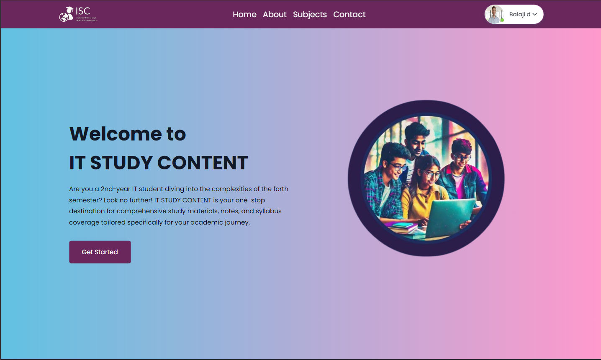
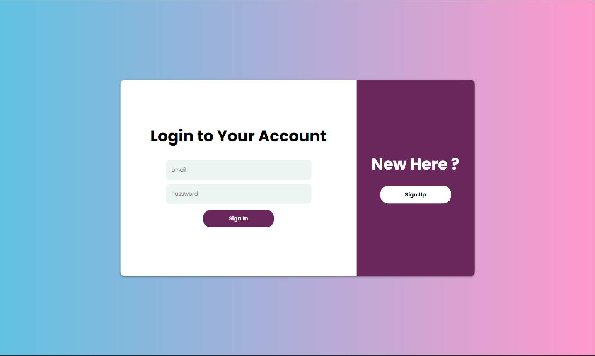
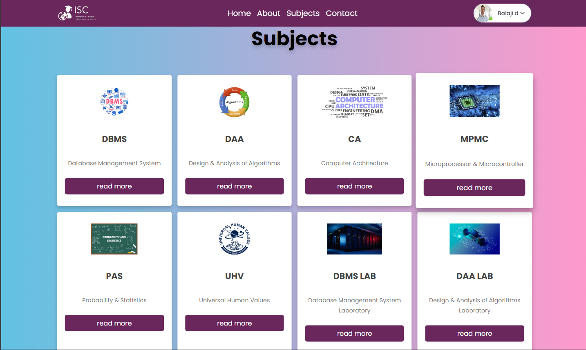
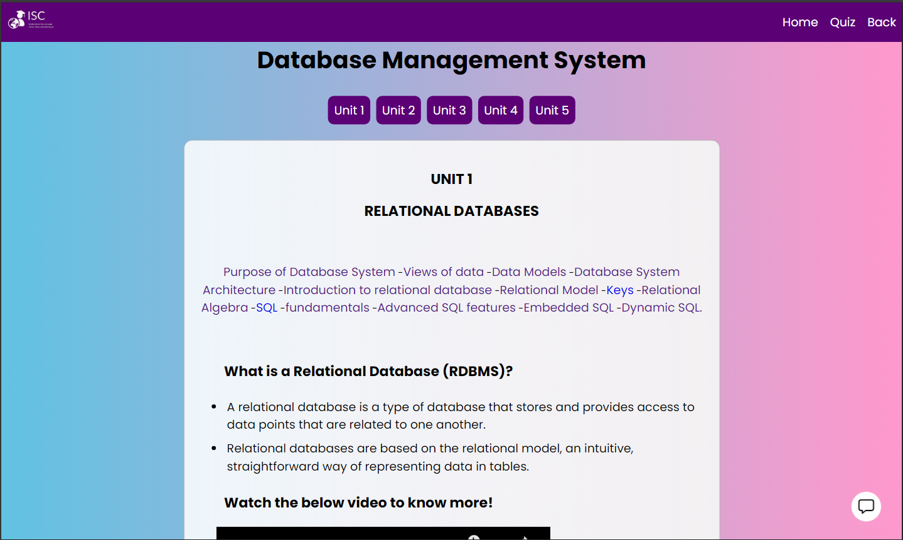
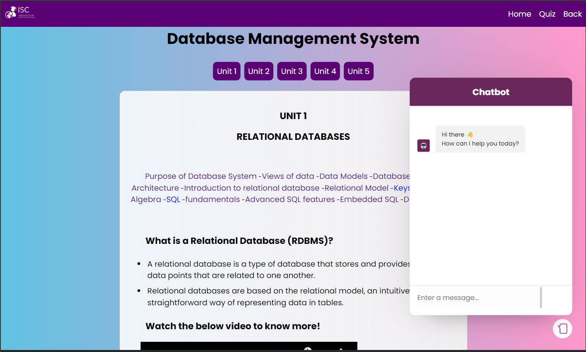
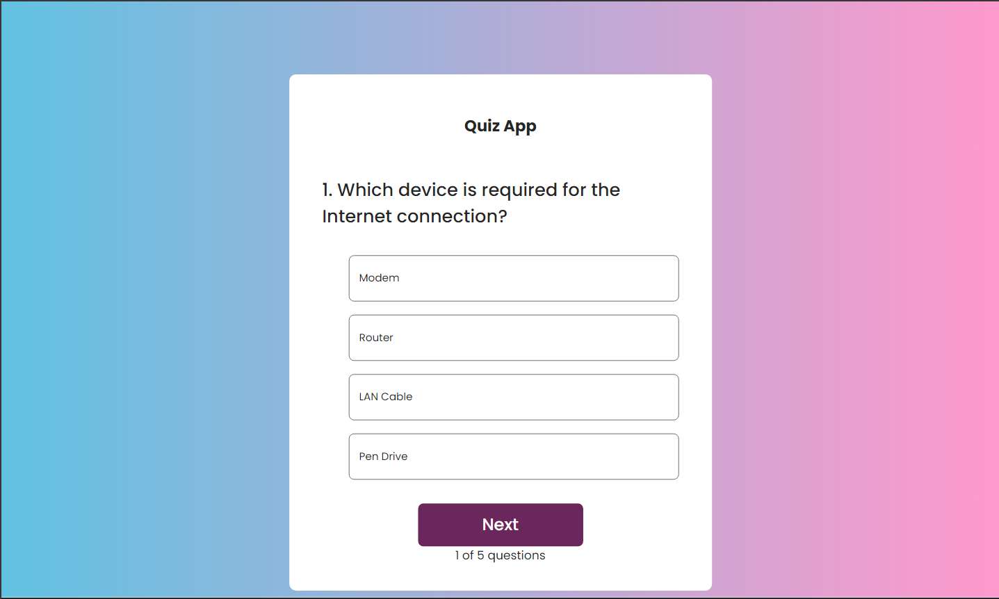

# Study Content Website with ReactJS, NodeJS, and MongoDB

## Overview

The Study Content Website is a dynamic online platform designed to provide comprehensive study materials related to IT and other subjects. Built using ReactJS for the frontend, NodeJS for the backend, and MongoDB for the database, this platform offers a user-friendly interface for accessing educational resources, creating personalized learning paths, and engaging in interactive assessments.

## Key Features

- **User Authentication**: Secure user authentication system to protect user data.
- **Concept-Based Learning**: Organized study materials based on key concepts for effective learning.
- **Search Functionality**: Easy navigation through vast study resources using a search feature.
- **Chatbot**: Real-time chat support for immediate assistance and guidance.
- **Quiz**: Interactive quizzes to test knowledge and track progress.
- **Responsive Design**: Seamless access across devices with a responsive and mobile-friendly design.

## Installation Guide

Follow these steps to set up the Study Content Website on your local machine:

1. Clone the repository to your local machine.
2. Navigate to the project directory in your terminal.
3. Install Node.js if not already installed on your system.
4. Install MongoDB if not already installed on your system.
5. In the terminal, navigate to the backend directory `cd server` and run `npm install` to install backend dependencies.
6. In the terminal, navigate to the frontend directory `cd client` and run `npm install` to install frontend dependencies.
7. Once dependencies are installed, run `npm start` in the backend and  run `npm run dev` in frontend directories to start the development servers.
8. Access the Study Content Website in your web browser at `http://localhost:5173/`.

## Screenshots

- **Homepage**
  
- **Login & Register Page**
  
- **Subjects Page**
  
- **Notes Page**
  
- **ChatBot Page**
  
- **Quiz Page**
  

## Acknowledgements

Special thanks to Deepan B for contributing to the frontend development of the project and collaborating on its completion.
